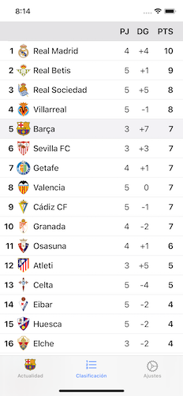

# CS50x Final Project: Futbolico

This project consists of an iOS app called Futbolico that allows you to get the latest results and news of your favourite team from the Spanish football (soccer) league as well as its upcoming matches and the current standings. Furthermore, some degree of customisation is possible through color themes and Light/Dark mode.

The app is in Spanish, as it is directed to the Spanish football fans community.

## Features

### Matches and Latest News
In this tab of the app, the user sees the recent and upcoming matches and the latest news about its favourite team. Also, the tab icon is set to be the crest of the user's favourite team.

Under the Matches (Partidos in Spanish) section, the user will see the result of the last match played by his team as well as the live result if the team is playing at that moment. Furthermore,  upcoming matches are also shown if there are any. Dates and times of upcoming matches are adjusted to the user's timezone.

The Latest News (Últimas Noticias in Spanish) section shows the latest articles published in Spanish about the team, at most 10. Moreover, tapping on one of the articles opens the full article on the publishers website.

### Standings

The Standings (Clasificación in Spanish) tab displays the current standings of the Spanish football league and the user's favourite team is highlighted.

### Settings

Within this tab the user can change its favourite team and modify the color theme of the app. Moreover, the app knows when the user's iPhone is in Light or Dark mode and changes its appearance to match the system.

## Technologies
This project was developed using Swift 5 and Xcode 11.

Furthermore, I used the following APIs to gather the football data and latest news:
* [football-data.org](https://www.football-data.org/) - Football data API
* [GNews](https://gnews.io/) - News API

**DISCLAIMER:** This was my first app and I don't claim to be an iOS app development expert.
